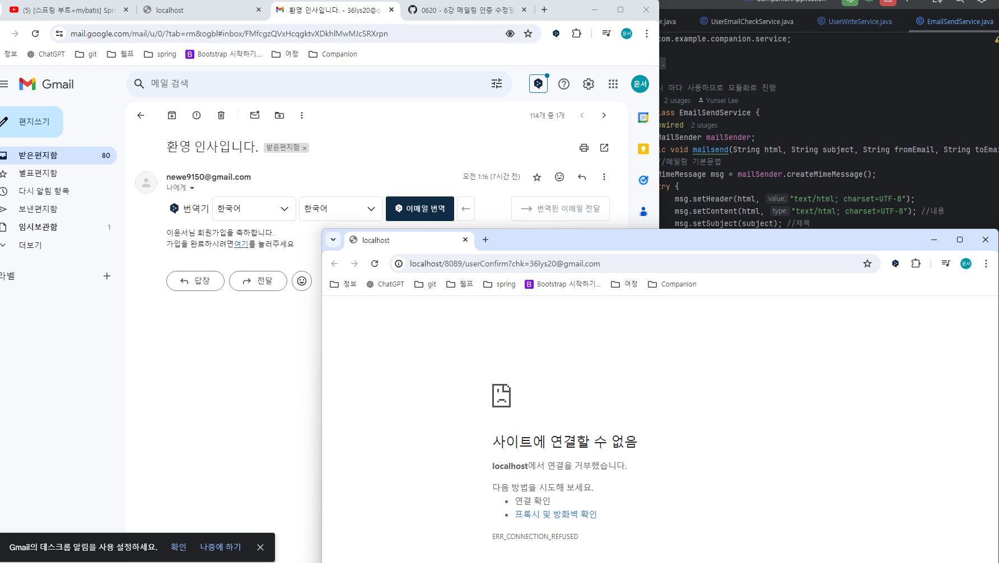
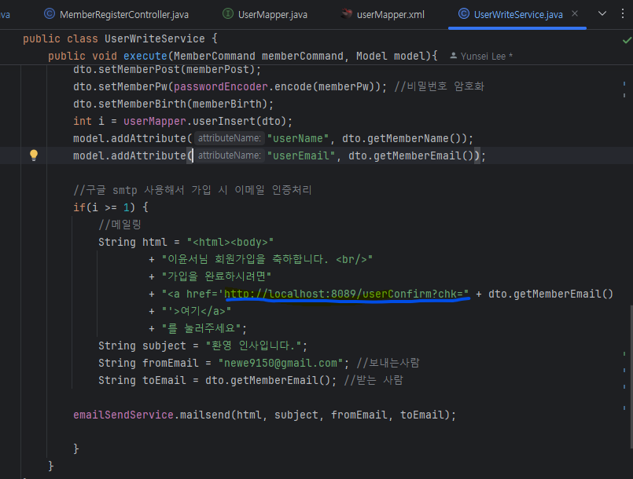
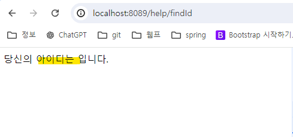
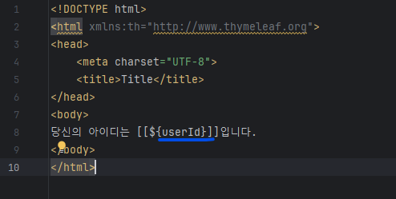
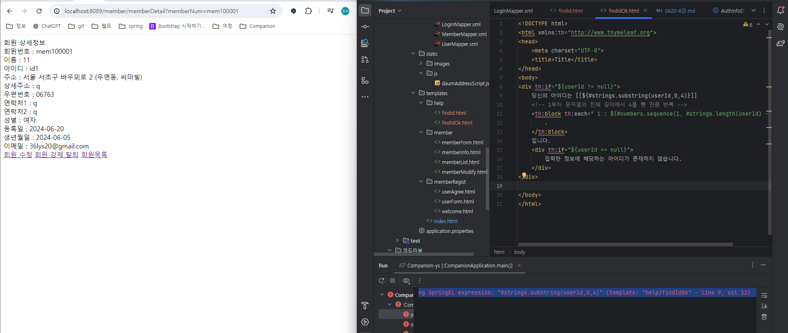
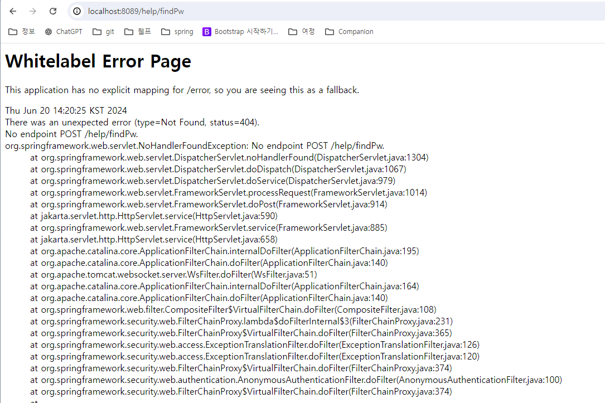
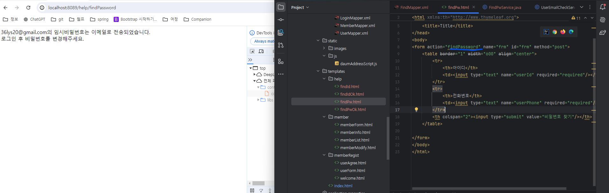

### * 메일링 인증메일 링크 에러
- 
- 인증메일 링크 접속 시 내용이 출력되지 않음
- EmailSendService에서 주소입력을 잘못했어서 수정완료
- 

### * 아이디 찾기에서 아이디값이 출력 안되는 에러 발생
- 
- 컬럼명이 달라서 에러 발생
- userID -> userId로 DTO에 적은 칼럼명이랑 동일하게 수정 후 에러 해결
- 

### * 아이디 찾기에서 아이디 길이 조건 에러
- 
- 아이디의 전체길이 - 4만 보여주고 나머지는 . 처리해서 보여주는 방식
- 현재 검색한 아이디의 길이가 4글자 이하라 에러발생
- 회원가입시 아이디 길이도 제약이 필요? 

### * 비밀번호 찾기 버튼 클릭 시 404에러

- 폼이름 오류 findPw -> findPassword로 수정
- 