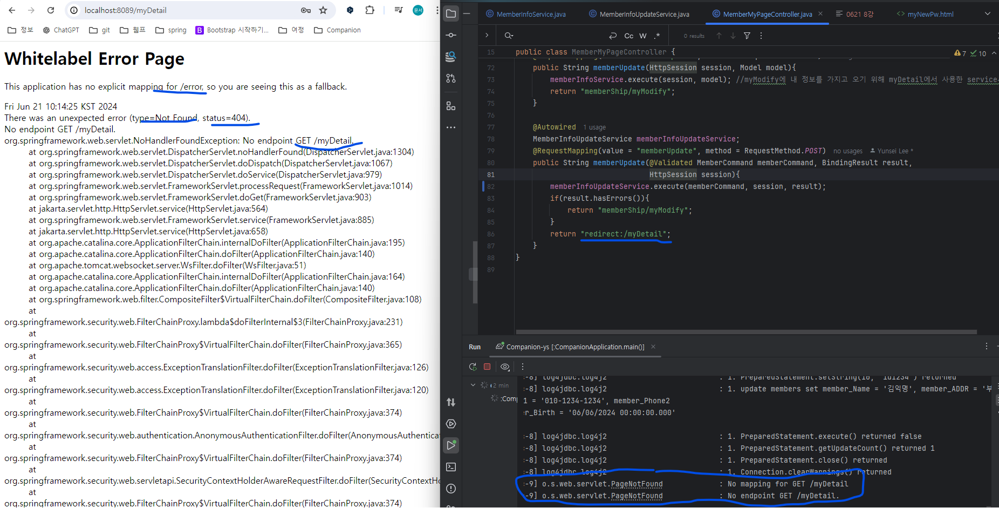
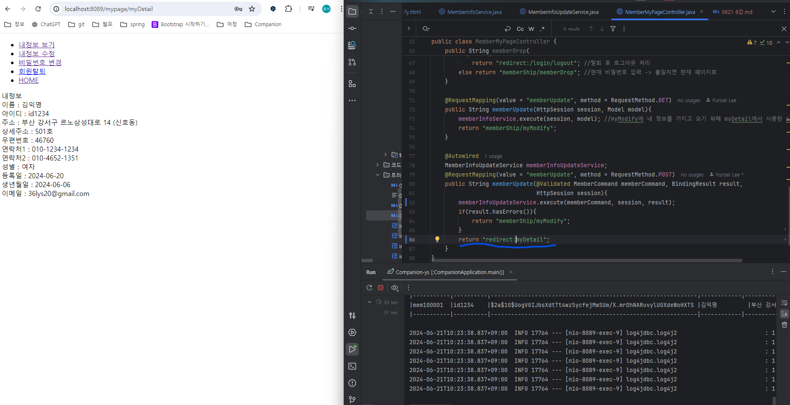

### redirect 절대경로 상대경로 에러

- 내정보 수정하고 제출 버튼 클릭 시 404에러 발생
- MemberMyPageController 에서 memberUpdate return 주소설정을 잘못함
- 작성한 코드는 redirect:/myDetail -> 절대경로
- 수정한 코드는 redirect:myDetail -> 상대경로
- 절대경로 사용 시 브라우저는 애플리케이션의 루트 경로를 기준으로 이동
-  -> 실제 경로 구조와 애플리케이션 루트 경로가 불일치하면 404오류 발생
- 현재는 수정된 정보를 가지고 다시 페이지로 리디렉션해야 하므로 상대경로를 사용해야 함.
- 상대 경로 사용 시 현재 경로를 기준으로 이동 -> 경로 구조 유지 가능
