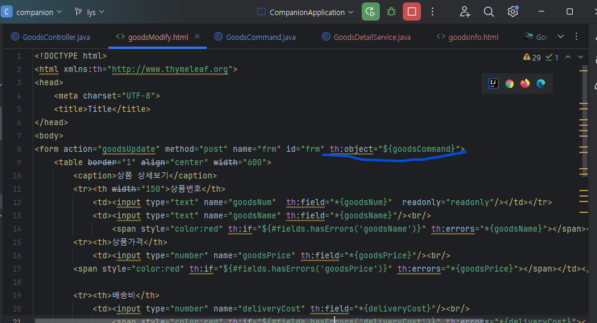

### 타임리프 트러블슈팅

#### 에러발생
- org.thymeleaf.exceptions.TemplateInputException
- Thymeleaf 템플릿 파싱 중에 발생한 예외

#### 원인
- 그러나 th:field 속성을 사용하고 있는데, 
관련 오류 메시지에서 문제가 되었던 goodsNum 필드 같은 경우는 
goodsCommand 객체와 연결되어야 함.
- goodsNum에 대한 바인딩이 문제가 있었습니다.

#### 해결
- 모델 객체의 존재: goodsCommand 객체가 컨트롤러에서 모델에 제대로 추가되었는지 확인하세요. 폼 데이터와 바인딩할 객체가 컨트롤러 메소드에서 model.addAttribute("goodsCommand", goodsCommandObject);를 통해 추가되어야 합니다.
- 폼의 th:object 설정: 현재 폼에 th:object="${goodsCommand}" 설정이 누락된 것으로 보입니다. 이 설정은 폼의 모든 th:field 속성이 참조하는 모델 객체를 지정합니다. 폼 태그 내에 다음과 같이 추가하세요

- <form action="goodsUpdate" method="post" th:object="${goodsCommand}" name="frm" id="frm">

